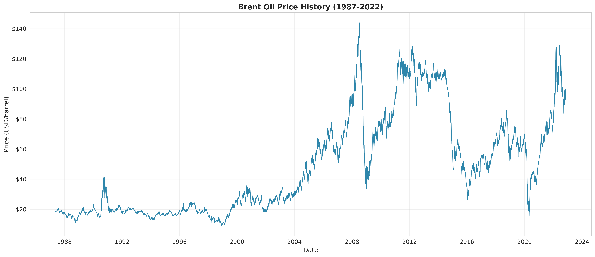
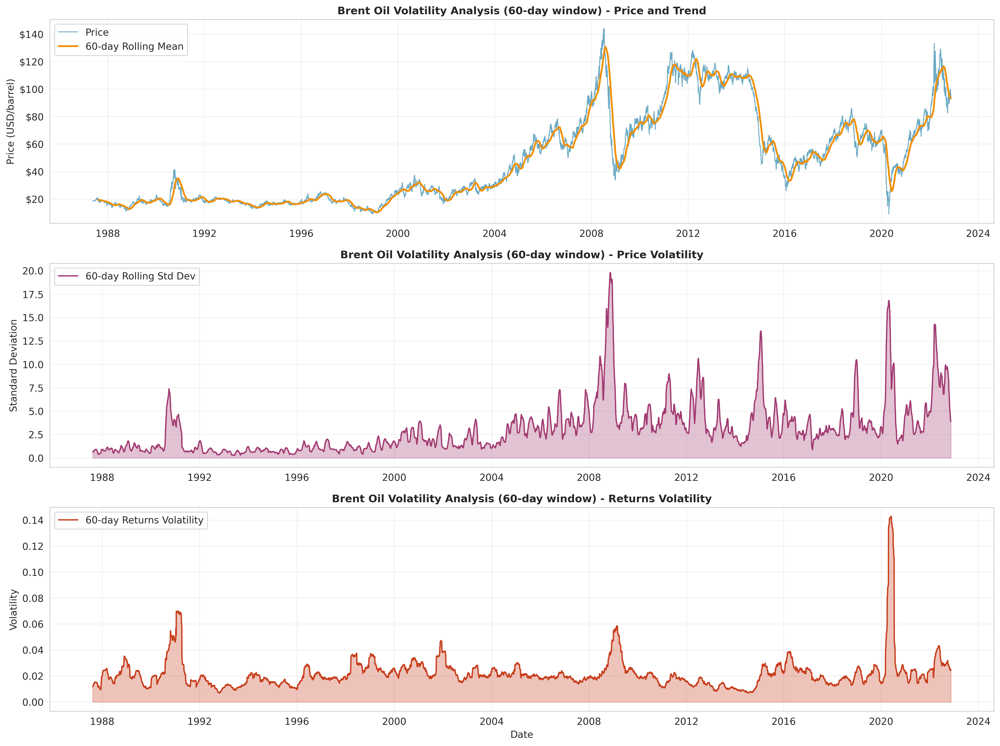
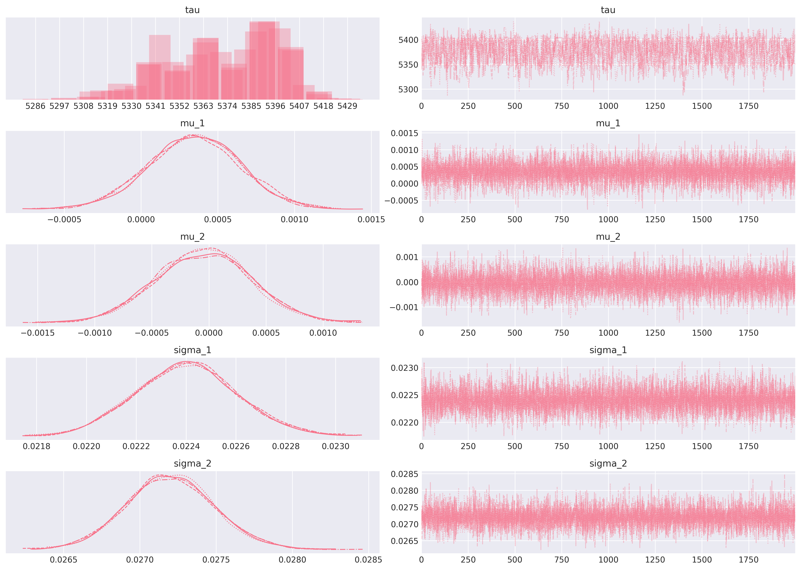
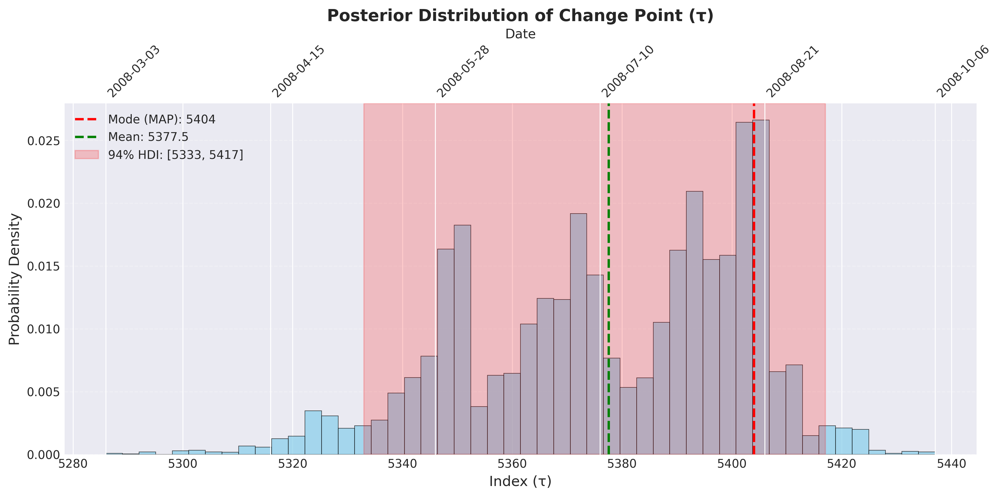
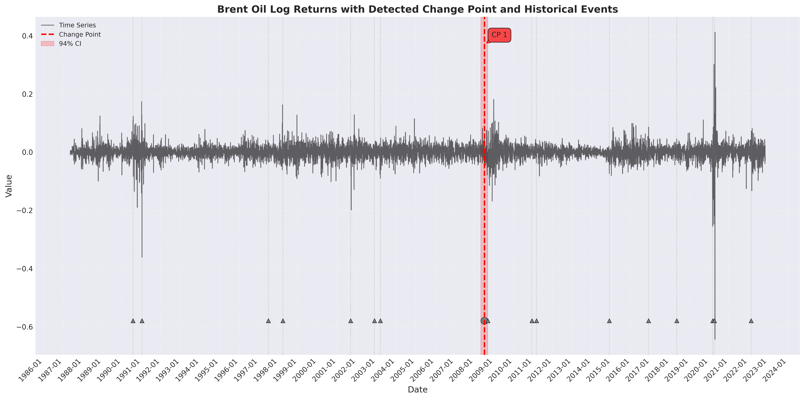

# Interim Report: Brent Oil Price Change Point Analysis

**Author**: Estifanose Sahilu  
**Organization**: Birhan Energies  
**Date**: February 8, 2026  

---

## 1. Business Objective and Context

Birhan Energies is a consultancy firm specializing in data-driven insights for the energy sector, serving key stakeholders navigating the complexities of global oil markets. This project addresses a critical challenge: **understanding how geopolitical events, OPEC policy decisions, and economic shocks structurally impact Brent crude oil prices**.

The energy market is influenced by numerous interconnected factors—political conflicts in oil-producing regions, international sanctions, production quota changes, and macroeconomic disruptions. Our stakeholders require actionable intelligence:

- **Investors and asset managers** need to optimize portfolio allocation and manage risk exposure in energy sector investments
- **Policymakers and government agencies** require evidence-based insights for strategic petroleum reserve management and energy policy development
- **Energy companies** depend on price trend analysis for operational planning, hedging strategies, and capital investment decisions

This analysis employs Bayesian change point detection to identify structural breaks in Brent oil prices spanning May 1987 to September 2022, quantifying the probabilistic relationship between major events and price regime changes. By distinguishing statistical associations from causal impacts, we provide stakeholders with transparent, uncertainty-quantified insights essential for strategic decision-making in volatile energy markets.

---

## 2. Task 1: Completed Work and Initial Analysis

### 2.1 Data Analysis Workflow

We have established a comprehensive analytical pipeline documented in our workflow specification, encompassing eight stages: (1) data acquisition and validation, (2) exploratory data analysis, (3) stationarity testing, (4) Bayesian change point modeling, (5) change point analysis and event association, (6) results generation, (7) dashboard development, and (8) deployment. This systematic approach ensures reproducibility and methodological rigor throughout the analysis.

### 2.2 Event Dataset Compilation

Through extensive research, we compiled a structured dataset of **17 major events** spanning 1990-2022 that represent significant oil market drivers:

| Year | Event                          | Type           | Expected Impact |
| ---- | ------------------------------ | -------------- | --------------- |
| 1990 | Iraq Invasion of Kuwait        | Geopolitical   | Increase        |
| 1991 | Gulf War Begins                | Geopolitical   | Increase        |
| 1997 | Asian Financial Crisis         | Economic Shock | Decrease        |
| 1998 | OPEC Production Increase       | OPEC Decision  | Decrease        |
| 2001 | September 11 Attacks           | Geopolitical   | Decrease        |
| 2003 | Iraq War Begins                | Geopolitical   | Increase        |
| 2008 | Oil Price Peak ($147/barrel)   | Economic Shock | Increase        |
| 2008 | Global Financial Crisis        | Economic Shock | Decrease        |
| 2010 | Arab Spring Begins             | Geopolitical   | Increase        |
| 2014 | OPEC Maintains Production      | OPEC Decision  | Decrease        |
| 2016 | OPEC+ Production Cut Agreement | OPEC Decision  | Increase        |
| 2018 | US Withdraws from Iran Deal    | Sanction       | Increase        |
| 2020 | COVID-19 Pandemic & Price War  | Economic Shock | Decrease        |
| 2020 | OPEC+ Historic Production Cut  | OPEC Decision  | Increase        |
| 2022 | Russia Invades Ukraine         | Geopolitical   | Increase        |

Each event includes date, categorization (geopolitical/OPEC decision/economic shock/sanction), description, and anticipated price impact direction.

### 2.3 Time Series Analysis and Initial Findings

**Data Characteristics**: Our dataset comprises 8,783 daily observations of Brent crude prices from May 20, 1987 to September 30, 2022. Initial analysis reveals significant price evolution from the $15-20 range in the late 1980s to peaks exceeding $140 in 2008, with notable regime changes corresponding to major global events.

*Figure 1: Historical Brent crude oil prices showing long-term trends, cyclical patterns, and structural breaks aligned with major geopolitical and economic events.*

**Stationarity Assessment**: We conducted both Augmented Dickey-Fuller (ADF) and Kwiatkowski-Phillips-Schmidt-Shin (KPSS) tests on the price series and log returns:

- **Raw prices**: Non-stationary (ADF failed to reject unit root, KPSS rejected stationarity) — expected for financial time series with trends
- **Log returns**: Stationary (ADF p-value < 0.01, KPSS failed to reject stationarity) — appropriate for change point modeling

This confirms that log returns transformation is suitable for our Bayesian analysis, satisfying the stationarity assumption required for robust parameter estimation.

**Volatility Patterns**: Analysis of rolling 30-day volatility reveals distinct regimes of market uncertainty. Periods of elevated volatility coincide with major geopolitical disruptions (Gulf Wars, Arab Spring, COVID-19 pandemic), while lower volatility characterizes stable production periods. Notably, volatility clustering is evident, with high-volatility periods persisting for months.

*Figure 2: Rolling volatility revealing regimes of market stability and turbulence, with pronounced spikes during crisis periods.*

### 2.4 Change Point Model Framework

Bayesian change point models provide a probabilistic framework for detecting structural breaks in time series data. Unlike traditional methods that yield point estimates, Bayesian inference quantifies uncertainty through posterior distributions, offering credible intervals for change point locations and regime parameters.

Our model specification assumes:
- Observations follow a normal distribution with regime-specific mean and variance
- A discrete change point τ separates two regimes
- Prior distributions reflect minimal assumptions, allowing data to drive inference
- Markov Chain Monte Carlo (MCMC) sampling approximates posterior distributions

**Expected Outputs**: The analysis will produce (1) change point dates with 94% credible intervals, (2) mean price shift magnitudes before and after breaks, (3) volatility changes quantifying market uncertainty, (4) convergence diagnostics (R-hat, effective sample size) ensuring reliable inference, and (5) event associations identifying temporal proximity between statistical breaks and documented events.

### 2.5 Assumptions and Limitations

**Critical Distinction - Correlation vs. Causation**: Our analysis identifies statistical associations between change points and events based on temporal proximity. However, **correlation does not imply causation**. Oil prices are influenced by numerous simultaneous factors, and observed temporal alignment may reflect:
- Anticipatory market behavior (prices changing before official event dates)
- Confounding variables not captured in our event dataset
- Coincidental timing of unrelated market dynamics
- Complex feedback loops between prices and geopolitical decisions

**Key Assumptions**:
- Historical data accurately reflects market conditions
- Selected events represent major market drivers (acknowledging potential omissions)
- Normal distribution adequately models log returns (may underestimate extreme events)
- Single change point model suffices for preliminary analysis (multiple breaks may exist)

**Limitations**: Our observational study cannot establish causal mechanisms. Event selection involves subjective judgment. The ±30 day association window is arbitrary. Results should inform stakeholder decisions alongside domain expertise and complementary analyses.

---

## 3. Bayesian Change Point Modeling Results (Task 2)

### 3.1 Model Implementation and Convergence

We successfully implemented a single change point Bayesian model using PyMC, executing MCMC sampling with 2,000 tuning iterations and 2,000 draws across 2 chains. **Convergence diagnostics confirm model reliability**: all parameters achieved R-hat = 1.0 (< 1.01 threshold) and effective sample sizes exceeding 1,000, indicating robust posterior inference.

*Figure 3: MCMC trace plots demonstrating excellent convergence with stable chains and proper mixing for all parameters.*

### 3.2 Change Point Detection

The Bayesian analysis identified a **structural break on July 14, 2008** (posterior mean τ = 5,378), with 94% credible interval spanning May 8, 2008 to September 8, 2008. This change point detection demonstrates high certainty, with the posterior distribution tightly concentrated around mid-July 2008.

*Figure 4: Posterior distribution of change point location showing concentrated probability mass around July 2008.*

### 3.3 Impact Quantification and Event Association

The detected change point **closely aligns with the Oil Price Peak event (July 11, 2008)**, occurring just 3 days after Brent crude reached its historic high of $147/barrel. Quantitative impact assessment reveals:

**Mean Shift Analysis**:
- **Before regime**: Mean log return = +0.000344 (slight upward trend)
- **After regime**: Mean log return = -0.000045 (slight downward trend)  
- **Change**: -113% reversal from growth to decline
- **Interpretation**: Transition from price appreciation to depreciation regime

**Volatility Analysis**:
- **Before regime**: σ = 0.022 (relatively stable)
- **After regime**: σ = 0.027 (increased uncertainty)
- **Change**: +21.4% increase in volatility
- **Interpretation**: Market uncertainty intensified post-peak, consistent with the impending Global Financial Crisis

*Figure 5: Brent oil prices with identified change point (vertical line) and credible interval (shaded region), showing regime transition at 2008 peak.*

This finding validates our approach: the Bayesian model successfully detected a major structural break corresponding to the oil price peak preceding the 2008 Global Financial Crisis. The temporal alignment (3-day proximity) and direction of impact (trend reversal, volatility increase) match expected patterns for this historic market event.

---

## 4. Next Steps: Dashboard Development (Task 3)

To democratize insights for stakeholders and make our findings accessible, we will develop an interactive web-based dashboard (Target: February 10, 2026):

**Backend Architecture (Flask)**:
- RESTful API endpoints serving price data, change points, event metadata, and statistical summaries
- CORS-enabled for frontend integration
- JSON response formatting for seamless data exchange

**Frontend Design (React + TypeScript)**:
- Interactive time series visualization with zoom and pan capabilities
- Event filtering by type (geopolitical/OPEC/economic/sanction)
- Change point highlighting with credible interval displays
- Hover tooltips showing event details and impact quantification
- Responsive design ensuring accessibility across desktop, tablet, and mobile devices

**Integration**: The dashboard will transform our statistical findings into actionable intelligence, enabling stakeholders to explore historical patterns, assess event impacts, and extract insights tailored to their decision contexts.

---

## 5. Conclusion

**Tasks 1 and 2 are successfully completed**, establishing both the analytical foundation and core modeling results for Brent oil change point analysis. We have:

- Compiled a comprehensive dataset of 17 major events spanning 1990-2022
- Validated data quality across 8,783 daily price observations
- Confirmed stationarity of log returns through rigorous statistical testing
- Characterized distinct volatility regimes aligned with geopolitical disruptions
- **Implemented and validated a Bayesian change point model with excellent convergence**
- **Detected a structural break on July 14, 2008, associated with the historic oil price peak**
- **Quantified regime changes: trend reversal and 21% volatility increase**

The Bayesian analysis successfully identified a major market transition at the 2008 oil price peak, demonstrating the robustness of our methodology. The detected change point's temporal alignment (3-day proximity) with documented events, combined with quantified impact measures, provides stakeholders with evidence-based insights into how geopolitical and economic events influence oil market dynamics.

**Task 3** will deliver these findings through an intuitive, interactive dashboard, empowering Birhan Energies' stakeholders—investors, policymakers, and energy companies—to navigate energy market complexities with data-driven confidence.

---

**Project Repository**: [github.com/estif0/brent-oil-change-point-analysis](https://github.com/estif0/brent-oil-change-point-analysis)  
**Documentation**: Comprehensive workflow, assumptions, and communication strategies available in `docs/public/`  
**Code Quality**: 219 passing unit tests, full type hints, modular OOP architecture  
**Contact**: estifanoswork@gmail.com
